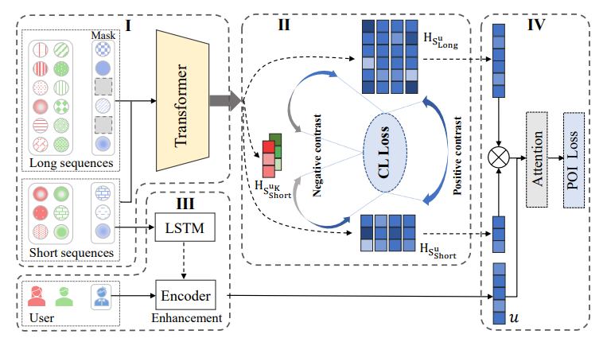

# CLSPRec

This is the pytorch implementation of paper "CLSPRec: Contrastive Learning of Long and Short-term Preferences for Next
POI Recommendation"



## Installation

```
pip install -r requirements.txt
```

## Valid Requirements

```
torch==2.0.1
numpy==1.24.3
pandas==2.0.2
Pillow==9.4.0
python-dateutil==2.8.2
pytz==2023.3
six==1.16.0
torchvision==0.15.2
typing_extensions==4.5.0
```

## Train

- Modify the configuration in settings.py

- Train and evaluate the model using python `main.py`.

- The training and evaluation results will be stored in `result` folder.